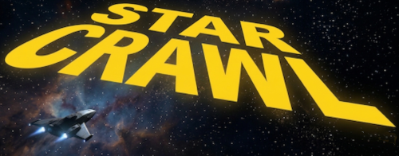

# Star Crawl
A Star Wars-inspired interactive space scene built with vanilla JavaScript and Canvas. Features a scrolling text crawl, animated starfield, flyby spaceship, and a slowly rotating planet.

---

## Project Structure
```
/
├── index.html
│
├── css/
│   └── style.css
│
├── data/
│   └── crawl-text.js
│
└── js/
    ├── Main.js
    ├── Controller.js
    ├── Scene.js
    ├── StarField.js
    ├── SceneConfig.js
    ├── Ship.js
    ├── ShipRenderer.js
    ├── SpaceAudio.js
    ├── Crawl.js
    ├── Timer.js
    ├── Hud.js
    └── PlanetRenderer.js
```

---

## Architecture
The project uses a fixed-timestep game loop pattern adapted from traditional game development.

**`Main.js`** owns the loop. It runs update at a locked 60hz regardless of monitor refresh rate, then calls draw every frame. `TIMESTEP_NORM` is always `1.0` so speed values are human-readable at 60hz with no manual scaling needed.

**`Controller.js`** is infrastructure only — owns audio and HUD, holds the active Scene. It exposes `update(dt)` and `draw()` which the loop calls each frame.

**`Scene.js`** owns everything visual and temporal — stars, ships, crawl, planet, and spawn timing. A different scene defines a completely different visual experience while following the same contract.

Each system follows the same contract:
- `update(dt)` — advances state, called at fixed 60hz timestep
- `draw()` — renders current state, called every frame

---

## Systems

### StarField
Three modes driven by `starModes` config at the top of `StarField.js`:
- **Calm** — stars twinkle in place
- **Drift** — stars fall downward and wrap
- **Warp** — stars radiate outward from centre

All magic numbers are consts at the top of the file. Speed is normalised against `STAR_BASE_H = 900` so behaviour is consistent across screen sizes.

### Scene / Ship / ShipRenderer / ShipConfig
`Scene` owns everything visual — stars, crawl, planet, and ship lifecycle. A `Timer` drives ship spawn intervals, switching between narrow and wide screen timings based on viewport width. All ship tuning values live in `ShipConfig.js`.

`ShipRenderer` handles all canvas drawing in local ship coordinate space. All coordinates and colours are consts at the top of the file. `Scene` handles the world transform (position, scale, rotation, alpha) before calling the renderer each frame.

Ship position is stored as `%` of screen dimensions so layout is resolution independent. Speed is normalised against `SHIP_BASE_H = 900` for consistent feel across screen sizes.

### PlanetRenderer
Renders a slowly rotating textured planet with optional rings. All tuning lives in the `PLANET_TUNING` object at the top of `PlanetRenderer.js` — no other file needs to be touched to restyle the planet.

The planet texture is generated once at construction time onto an offscreen canvas, then projected slice-by-slice each frame to simulate a rotating sphere. Rings are drawn in two passes (back half before the planet, front half after) so the planet correctly occludes the ring plane.

Low-level rendering constants (light colour, shadow colour, atmosphere radii defaults) live in `COSMETIC_CONFIG`. Resolution and projection constants live in `PHYSICS_CONFIG`.

### Crawl
Parses plain text from `crawl-text.js` into DOM elements and scrolls them using a CSS 3D perspective transform. Supports titles (`#`), paragraph breaks, and spacers (`---`). Speed normalised against `CRAWL_BASE_H = 900`.

### Timer
General purpose countdown/countup timer driven by `dt`. Used by `Scene` to control ship spawn intervals. Supports loop mode and `setAndStart()` for reuse without creating a new instance.

### SpaceAudio
Procedural audio built on the Web Audio API — no audio files required. Generates a filtered noise drone on startup and a short noise burst for UI clicks. All audio constants at the top of the file.

### HUD
Wires up speed and star mode button groups. Auto-hides after `HUD_HIDE_DELAY` ms of inactivity, reappears on mouse or touch. Callbacks injected from `Controller` so HUD has no direct references to other systems.

---

## Configuration

### Crawl text
Edit `data/crawl-text.js`. Syntax:

| Syntax | Result |
|---|---|
| `#MY TITLE` | Large centred gold title |
| `---` | Tall spacer gap |
| Blank line | Paragraph break |

### Ship tuning
All ship behaviour controlled by constants at the top of `ShipConfig.js`:

| Key | Description |
|---|---|
| `spawnX` | Spawn position as % of screen width |
| `spawnY` | Spawn position as % of screen height |
| `speed` | Movement speed per tick |
| `driftX` | Horizontal drift per tick |
| `size` | Ship scale as % of screen width |
| `flattenY` | Vertical squash for belly-view perspective |
| `rotation` | Angle in multiples of π |
| `fadeOutZone` | % from top where fade begins (set to -999 to disable) |

### Ship intervals
Spawn timing controlled in `ShipConfig.js`:

| Key | Description |
|---|---|
| `narrow` | Ms between ships on screens below breakpoint |
| `wide` | Ms between ships on screens above breakpoint |
| `breakpoint` | Screen width in px that switches between narrow and wide |

### Star modes
Edit the `starModes` object at the top of `StarField.js`:

| Key | Description |
|---|---|
| `speed` | Movement speed |
| `stretch` | Warp streak length |
| `count` | Number of stars |

### Planet (`PLANET_TUNING` in `PlanetRenderer.js`)

**Position & motion**

| Key | Description |
|---|---|
| `x` | Horizontal position as fraction of screen width |
| `y` | Vertical position as fraction of screen height |
| `scale` | Size multiplier applied to `PHYSICS_CONFIG.BASE_RADIUS` |
| `tilt` | Axial tilt in radians |
| `spinSpeed` | Rotation increment per tick |

**Colours**

| Key | Description |
|---|---|
| `baseColor` | Base fill colour of the texture |
| `atmosColor` | Atmosphere glow colour (rgba) |
| `atmosInnerRadius` | Glow start radius as multiplier of planet radius |
| `atmosOuterRadius` | Glow end radius as multiplier of planet radius |

**Surface bands**

| Key | Description |
|---|---|
| `bandCount` | Number of dark latitude stripes (0 = none) |
| `bandOpacityMin` | Alpha of the faintest band |
| `bandOpacityMax` | Alpha of the darkest band |

**Grit**

| Key | Description |
|---|---|
| `gritCount` | Number of surface noise dots painted on the texture |

**Craters**

Craters are defined as an array of groups in `PLANET_TUNING.craters`. Each group is painted independently, so you can layer large sparse craters on top of dense small ones, or pin a group to a latitude zone. Falls back to flat `craterCount` / `craterMinR` / `craterMaxR` / `craterColor` props if the array is absent.

| Key | Description |
|---|---|
| `count` | Number of craters in this group |
| `minR` | Smallest crater radius in texture pixels |
| `maxR` | Largest crater radius in texture pixels |
| `color` | Pit fill colour |
| `rimColor` | Highlight ring colour — set alpha to 0 to hide |
| `depthColor` | Inner radial shadow colour for a 3-D bowl effect |
| `latBand` | `[minFrac, maxFrac]` — constrains craters to a latitude strip. `0` = north pole, `1` = south pole. Omit to scatter across the whole surface. |

Example with two groups:
```js
craters: [
  {
    count: 120, minR: 5, maxR: 20,
    color: 'rgba(0,0,0,0.4)',
    rimColor: 'rgba(255,255,255,0.12)',
    depthColor: 'rgba(0,0,0,0.45)',
  },
  {
    count: 40, minR: 3, maxR: 8,
    color: 'rgba(0,0,0,0.3)',
    rimColor: 'rgba(255,255,255,0.18)',
    depthColor: 'rgba(0,0,0,0.35)',
    latBand: [0.0, 0.25],  // north pole cap only
  },
],
```

**Rings**

Rings are defined as an array in `PLANET_TUNING.rings`. Each entry is drawn independently — add as many as you like, or set to `[]` for none. Each ring is split into a back half (drawn before the planet) and a front half (drawn after) so the planet correctly occludes the ring plane.

| Key | Description |
|---|---|
| `innerRadius` | Inner edge as a multiplier of planet radius |
| `outerRadius` | Outer edge as a multiplier of planet radius |
| `color` | Ring fill colour (rgba) — fades to transparent at both edges |
| `tilt` | Ring plane tilt in radians. Defaults to `PLANET_TUNING.tilt` |
| `scaleY` | Perspective squash. `0.1` = nearly edge-on, `0.5` = more face-on |

Example with two rings:
```js
rings: [
  { innerRadius: 1.35, outerRadius: 1.75, color: 'rgba(180,160,120,0.30)', tilt: 0.35 },
  { innerRadius: 1.80, outerRadius: 2.05, color: 'rgba(130,110,80,0.18)',  tilt: 0.35 },
],
```

### Crawl appearance
CSS custom properties at the top of `style.css` control the crawl geometry:

| Variable | Description |
|---|---|
| `--crawl-perspective` | 3D perspective depth |
| `--crawl-pitch` | Forward tilt angle |
| `--crawl-width` | Text column width |
| `--crawl-vanish-x/y` | Vanishing point position |

### HUD behaviour
Constants at the top of `Hud.js`:

| Constant | Description |
|---|---|
| `HUD_HIDE_DELAY` | Ms of inactivity before HUD hides |
| `HUD_TRANSITION` | CSS transition string for show/hide animation |

---

## Key Conventions
- Ship coordinates are in local space (-250 to 250 x, -110 to 110 y)
- Scene handles world transform before calling ShipRenderer.draw(ctx)
- All magic numbers are consts at the top of each file
- All colours in ShipRenderer.js are consts at the top of the file
- All crawl/scene CSS values are custom properties in :root in style.css
- TIMESTEP_NORM = 1.0 always — speeds are tuned at 60hz, no dt scaling needed
- Speed normalised against BASE_H = 900 so behaviour is consistent across screen sizes
- Position stored as % of screen so layout is resolution independent
- Scripts loaded in dependency order in index.html — no modules, no imports
- Planet texture is generated once at construction; call `new PlanetRenderer()` again to reseed

---

## Planned Next Steps
1. **StateMachine** — BOOT, SCENE, SETTINGS, TRANSITION states
2. **Settings page** — replace HUD with a full screen settings state
3. **Transition system** — fade between states
4. **EventBus + ScrollClock** — cue-based ship spawning at dramatic crawl moments
5. **Second scene** — FlyoverScene or similar, same update/draw contract
6. **Second ship type** — new ShipRenderer, random or cue-driven selection

---

## Adding a New Ship Type
1. Create `ShipRendererB.js` following the same pattern as `ShipRenderer.js`
2. Add a script tag in `index.html` before `Scene.js`
3. In `Scene._spawnShip()` choose which renderer to instantiate

## Adding a New Scene
1. Create `SceneB.js` with the same `update(dt)` / `draw()` contract
2. In `Controller` swap `this.scene = new SceneB(this.audio)`

---

## Browser Support
No build step, no dependencies, no bundler. Runs directly in any modern browser that supports:
- Canvas 2D
- Web Audio API
- CSS 3D transforms
- `requestAnimationFrame`